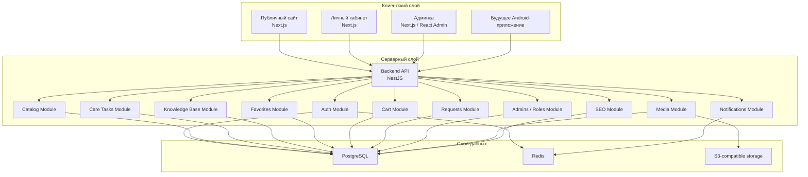

# Component Diagram WeilShop

Ниже приведена компонентная диаграмма системы `WeilShop` в формате `Mermaid`.

```mermaid
flowchart TD
    subgraph ClientLayer["Клиентский слой"]
        publicSite["Публичный сайт\nNext.js"]
        accountUi["Личный кабинет\nNext.js"]
        adminUi["Админка\nNext.js / React Admin"]
        androidApp["Будущее Android-приложение"]
    end

    subgraph ApiLayer["Серверный слой"]
        apiGateway["Backend API\nNestJS"]
        auth["Auth Module"]
        catalog["Catalog Module"]
        taskModule["Care Tasks Module"]
        knowledge["Knowledge Base Module"]
        favorites["Favorites Module"]
        cart["Cart Module"]
        requests["Requests Module"]
        admins["Admins / Roles Module"]
        media["Media Module"]
        seo["SEO Module"]
        notifications["Notifications Module"]
    end

    subgraph DataLayer["Слой данных"]
        db["PostgreSQL"]
        cache["Redis"]
        storage["S3-compatible storage"]
    end

    publicSite --> apiGateway
    accountUi --> apiGateway
    adminUi --> apiGateway
    androidApp --> apiGateway

    apiGateway --> auth
    apiGateway --> catalog
    apiGateway --> taskModule
    apiGateway --> knowledge
    apiGateway --> favorites
    apiGateway --> cart
    apiGateway --> requests
    apiGateway --> admins
    apiGateway --> media
    apiGateway --> seo
    apiGateway --> notifications

    auth --> db
    auth --> cache
    catalog --> db
    taskModule --> db
    knowledge --> db
    favorites --> db
    cart --> db
    requests --> db
    admins --> db
    media --> storage
    media --> db
    seo --> db
    notifications --> cache
```
