# ER-диаграмма WeilShop

Ниже приведена `ER`-диаграмма в формате `Mermaid` для основных сущностей проекта `WeilShop`.

```mermaid
erDiagram
    USERS {
        uuid id PK
        string first_name
        string last_name
        string email
        string phone
        string password_hash
        boolean is_email_verified
        boolean is_phone_verified
        string status
        datetime created_at
        datetime updated_at
    }

    PRODUCTS {
        uuid id PK
        string name
        string slug
        string sku
        uuid brand_id FK
        uuid category_id FK
        text short_description
        text full_description
        text usage_method
        text benefits
        text precautions
        string volume
        boolean is_active
        int sort_order
        datetime created_at
        datetime updated_at
    }

    CATEGORIES {
        uuid id PK
        string name
        string slug
        text description
        uuid parent_id FK
        boolean is_active
    }

    BRANDS {
        uuid id PK
        string name
        string slug
        text description
        uuid logo_media_id FK
        boolean is_active
    }

    CARE_TASKS {
        uuid id PK
        string name
        string slug
        text short_description
        text full_description
        text problem_description
        text step_by_step
        text faq_block
        boolean is_active
    }

    PRODUCT_CARE_TASKS {
        uuid product_id FK
        uuid care_task_id FK
    }

    ARTICLES {
        uuid id PK
        string title
        string slug
        text preview_text
        text content
        uuid cover_media_id FK
        uuid author_id FK
        boolean is_published
        datetime published_at
    }

    INSTRUCTIONS {
        uuid id PK
        string title
        string slug
        text content
        uuid related_product_id FK
        uuid related_task_id FK
        boolean is_published
    }

    FAQ_ITEMS {
        uuid id PK
        string question
        text answer
        int sort_order
        boolean is_published
        uuid related_product_id FK
        uuid related_task_id FK
    }

    FAVORITES {
        uuid id PK
        uuid user_id FK
        uuid product_id FK
    }

    CART_ITEMS {
        uuid id PK
        uuid user_id FK
        uuid product_id FK
        int quantity
    }

    REQUEST_ORDERS {
        uuid id PK
        uuid user_id FK
        string status
        string customer_name
        string customer_email
        string customer_phone
        text comment
        text admin_comment
        datetime created_at
        datetime updated_at
    }

    REQUEST_ORDER_ITEMS {
        uuid id PK
        uuid request_order_id FK
        uuid product_id FK
        string product_name_snapshot
        int quantity
    }

    REQUEST_STATUS_HISTORY {
        uuid id PK
        uuid request_order_id FK
        string old_status
        string new_status
        uuid changed_by_admin_id FK
        text comment
        datetime created_at
    }

    ADMINS {
        uuid id PK
        string name
        string email
        string password_hash
        string status
        datetime created_at
    }

    ROLES {
        uuid id PK
        string name
        string code
    }

    ADMIN_ROLES {
        uuid admin_id FK
        uuid role_id FK
    }

    MEDIA_FILES {
        uuid id PK
        string path
        string type
        string alt
        int size
    }

    SEO_META {
        uuid id PK
        string entity_type
        uuid entity_id
        string meta_title
        string meta_description
        string meta_keywords
        string og_title
        string og_description
    }

    CARE_KITS {
        uuid id PK
        string name
        string slug
        text description
        uuid care_task_id FK
        boolean is_active
        int sort_order
        datetime created_at
        datetime updated_at
    }

    CARE_KIT_ITEMS {
        uuid id PK
        uuid care_kit_id FK
        uuid product_id FK
        int step_number
        string title
        text description
    }

    PRODUCT_VIEWS {
        uuid id PK
        uuid user_id FK
        uuid product_id FK
        datetime viewed_at
    }

    CONSULTATION_REQUESTS {
        uuid id PK
        uuid user_id FK
        uuid care_task_id FK
        uuid assigned_admin_id FK
        string customer_name
        string customer_email
        string customer_phone
        text message
        string status
        text response
        datetime created_at
        datetime updated_at
    }

    CONSULTATION_REQUEST_PRODUCTS {
        uuid consultation_request_id FK
        uuid product_id FK
    }

    NOTIFICATION_PREFERENCES {
        uuid id PK
        uuid user_id FK
        string type
        string channel
        boolean is_enabled
        datetime created_at
        datetime updated_at
    }

    NOTIFICATIONS {
        uuid id PK
        uuid user_id FK
        uuid request_order_id FK
        uuid consultation_request_id FK
        string type
        string channel
        string status
        string title
        text message
        datetime sent_at
        datetime read_at
        datetime created_at
        datetime updated_at
    }

    PRODUCT_COMPARISONS {
        uuid id PK
        uuid user_id FK
        string title
        datetime created_at
        datetime updated_at
    }

    PRODUCT_COMPARISON_ITEMS {
        uuid comparison_id FK
        uuid product_id FK
        datetime added_at
    }

    CATEGORIES ||--o{ PRODUCTS : contains
    CATEGORIES ||--o{ CATEGORIES : parent_of
    BRANDS ||--o{ PRODUCTS : owns
    MEDIA_FILES ||--o| BRANDS : logo_for

    PRODUCTS ||--o{ PRODUCT_CARE_TASKS : linked
    CARE_TASKS ||--o{ PRODUCT_CARE_TASKS : linked

    USERS ||--o{ FAVORITES : has
    PRODUCTS ||--o{ FAVORITES : saved

    USERS ||--o{ CART_ITEMS : owns
    PRODUCTS ||--o{ CART_ITEMS : added

    USERS ||--o{ REQUEST_ORDERS : creates
    REQUEST_ORDERS ||--o{ REQUEST_ORDER_ITEMS : includes
    PRODUCTS ||--o{ REQUEST_ORDER_ITEMS : referenced
    REQUEST_ORDERS ||--o{ REQUEST_STATUS_HISTORY : tracks
    ADMINS ||--o{ REQUEST_STATUS_HISTORY : changes
    USERS ||--o{ PRODUCT_VIEWS : views
    PRODUCTS ||--o{ PRODUCT_VIEWS : viewed
    USERS ||--o{ NOTIFICATION_PREFERENCES : configures
    USERS ||--o{ NOTIFICATIONS : receives
    REQUEST_ORDERS ||--o{ NOTIFICATIONS : triggers

    ADMINS ||--o{ ADMIN_ROLES : assigned
    ROLES ||--o{ ADMIN_ROLES : grants
    ADMINS ||--o{ CONSULTATION_REQUESTS : handles

    ADMINS ||--o{ ARTICLES : authors
    MEDIA_FILES ||--o| ARTICLES : cover_for

    PRODUCTS ||--o{ INSTRUCTIONS : referenced_by
    CARE_TASKS ||--o{ INSTRUCTIONS : referenced_by

    PRODUCTS ||--o{ FAQ_ITEMS : has
    CARE_TASKS ||--o{ FAQ_ITEMS : has
    CARE_TASKS ||--o{ CARE_KITS : groups
    CARE_KITS ||--o{ CARE_KIT_ITEMS : contains
    PRODUCTS ||--o{ CARE_KIT_ITEMS : used_in
    USERS ||--o{ CONSULTATION_REQUESTS : creates
    CARE_TASKS ||--o{ CONSULTATION_REQUESTS : relates
    CONSULTATION_REQUESTS ||--o{ CONSULTATION_REQUEST_PRODUCTS : includes
    PRODUCTS ||--o{ CONSULTATION_REQUEST_PRODUCTS : references
    CONSULTATION_REQUESTS ||--o{ NOTIFICATIONS : triggers
    USERS ||--o{ PRODUCT_COMPARISONS : owns
    PRODUCT_COMPARISONS ||--o{ PRODUCT_COMPARISON_ITEMS : includes
    PRODUCTS ||--o{ PRODUCT_COMPARISON_ITEMS : compared
```

## Примечания

- `CareTask` выделена в отдельную сущность, так как это ключевой сценарий навигации по сайту.
- `RequestOrder` используется вместо полноценного заказа с оплатой.
- `RequestStatusHistory` нужна для отображения истории изменения статусов в личном кабинете.
- `SEO_META` сделана универсальной таблицей для разных типов сущностей.
- `MEDIA_FILES` используется для изображений товаров, брендов, статей и других материалов.
- `CARE_KITS` и `CARE_KIT_ITEMS` нужны для пошаговых наборов средств по задачам ухода.
- `PRODUCT_VIEWS` используется для истории просмотров и будущих рекомендаций.
- `CONSULTATION_REQUESTS` покрывает сценарий консультации по подбору автохимии.
- `NOTIFICATIONS` и `NOTIFICATION_PREFERENCES` позволяют развивать `email`, `sms`, `push`, `telegram` и `in-app` уведомления.
- `PRODUCT_COMPARISONS` нужен для сохраненного списка сравнения товаров.
