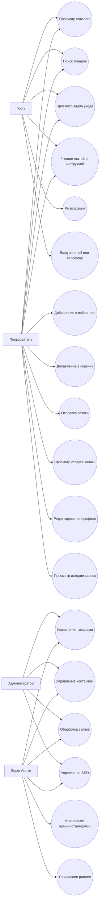

# Use Case Diagram WeilShop

Ниже приведена `use case`-диаграмма в формате `Mermaid` для основных ролей проекта.

```mermaid
flowchart LR
    guest["Гость"]
    user["Пользователь"]
    admin["Администратор"]
    superAdmin["Super Admin"]

    uc1(("Просмотр каталога"))
    uc2(("Поиск товаров"))
    uc3(("Просмотр задач ухода"))
    uc4(("Чтение статей и инструкций"))
    uc5(("Регистрация"))
    uc6(("Вход по email или телефону"))
    uc7(("Добавление в избранное"))
    uc8(("Добавление в корзину"))
    uc9(("Отправка заявки"))
    uc10(("Просмотр статуса заявки"))
    uc11(("Редактирование профиля"))
    uc12(("Просмотр истории заявок"))
    uc13(("Управление товарами"))
    uc14(("Управление контентом"))
    uc15(("Обработка заявок"))
    uc16(("Управление администраторами"))
    uc17(("Управление ролями"))
    uc18(("Управление SEO"))

    guest --> uc1
    guest --> uc2
    guest --> uc3
    guest --> uc4
    guest --> uc5
    guest --> uc6

    user --> uc1
    user --> uc2
    user --> uc3
    user --> uc4
    user --> uc7
    user --> uc8
    user --> uc9
    user --> uc10
    user --> uc11
    user --> uc12

    admin --> uc13
    admin --> uc14
    admin --> uc15
    admin --> uc18

    superAdmin --> uc13
    superAdmin --> uc14
    superAdmin --> uc15
    superAdmin --> uc16
    superAdmin --> uc17
    superAdmin --> uc18
```
